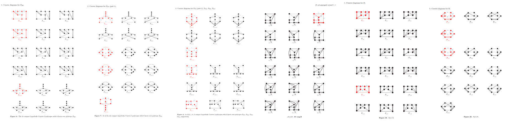
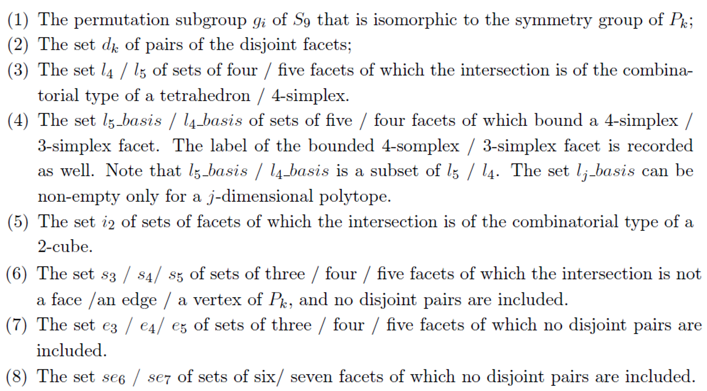
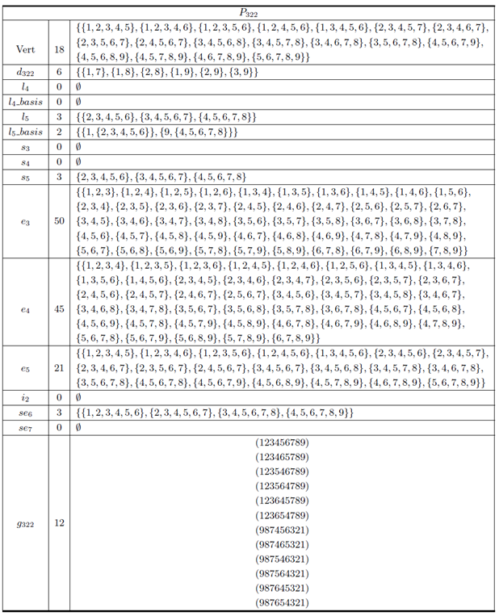
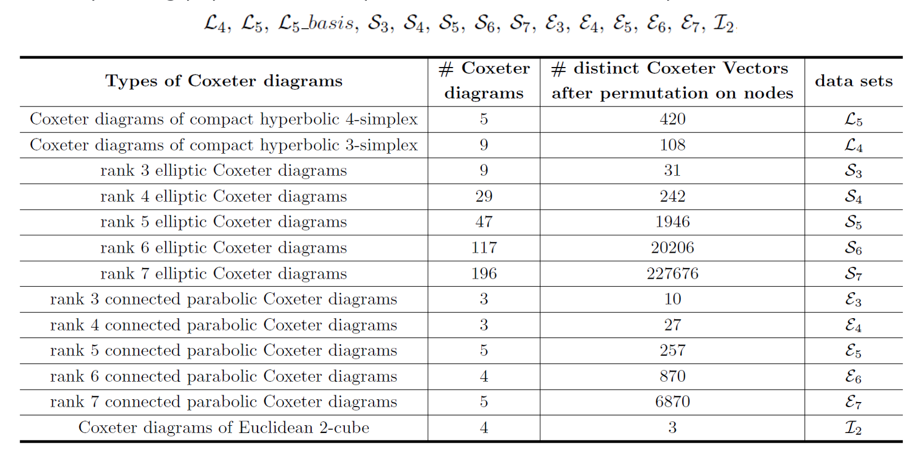
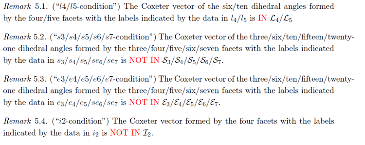
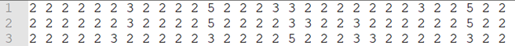
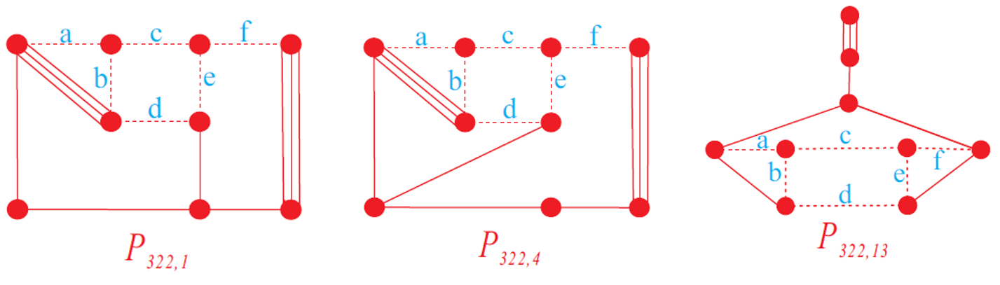

# HCPdm

## What is it?

This project **HCPdm** is for numerating **d**-dimensional **H**yperbolic **C**oxeter **P**olytopes with **m** facets. 
So far, we have completed the computation about compact hyperbolic Coxeter 4-polytopes/5-polytopes with 8/9 facets 
(realized by module chcp48 and chcp59, respectively) and all the hyperbolic Coxeter 4-polytopes with 7 facets 
(realized by module hcp47). The main results are as follows:

>There are exactly **348** compact hyperbolic Coxeter 4-polytopes with 8 facets.[1]
> 
>There are exactly **51** compact hyperbolic Coxeter 5-polytopes with 9 facets.[2]
> 
>There are exactly **275** hyperbolic Coxeter 4-polytopes with 7 facets.[3]

## How it works

The processes for all the cases consist of, roughly speaking, four steps, although they differ in many details:

###  1.Combinatorial preparation: 
Collect all the combinatorial types (i.e., **vertex flags***) of d-polytopes with m facets and compute some useful **data** (this is a special term referring to the ones defined in the corresponding paper) for each one.

The combinatoric types of 37 4-polytopes with 8 facets were listed by Grunbaum and Sreedharan and we made some corrections about their Table 4 in our paper [1]. The enumeration of 322 5-polytops with 9 facets are due to the work of K. Fukuda, H. Miyata and S. Moriyama and can be downloaded from 
https://www-imai.is.s.u-tokyo.ac.jp/~hmiyata/oriented_matroids/index.html.
The 31 4-polytops with 7 facets are found by many authors and we obtain it through https://firsching.ch/polytopes.html
Readers can refer to the folder **polytopeDATA** for all the above files about **vertex flags**. For example, the data on line 322 of d5m9.txt is as follows:

>[9,8,7,6,5] [9,8,7,6,4] [9,8,7,5,4] [9,8,6,5,4] [9,7,6,5,4] [8,7,6,5,3] [8,7,6,4,3] [8,7,5,4,3] [8,6,5,4,3] [7,6,5,4,2] [7,6,5,3,2] [7,6,4,3,2] [7,5,4,3,2] [6,5,4,3,1] [6,5,4,2,1] [6,5,3,2,1] [6,4,3,2,1] [5,4,3,2,1]

where the number 1, 2,…,9 denote the nine facets and each square bracket corresponds to one vertex that is incident to the enclosed five facets. For example, there are 18 vertices of the above polytope P<sub>322</sub> as shown above.

We define in [2] the following data for each 5-dimensonal polytopes P<sub>k</sub> with 9 facets:


<div align="center"></div>


And we can take P<sub>322</sub> as an example as follows. 
In the code, all but the permutation subgroup g<sub>k</sub> are generated before the pasting. 
The symmetry group g<sub>k</sub> for **chcp48** are generated separately and that of **chcp59** has merged to the main body of the code, 
which is calculated right after the round 1* of the pasting. 
In the directories of **./output/P9_322** and **./output/P8_17**, the files **P9_322_per.txt** and **P8_17_per.txt** store the desired permutation subgroups, respectively, as illustrations. 


<div align="center"></div>

## 2. Library preparation:

We prepare some libraries for the step 3 of refined pasting. The libraries need are stated in corresponding papers. For example, the libraries need for **chcp59** are

<div align="center"></div>


All the possibly needed libraries are generated beforehand and saved in the folder **ToolPolytope**.
And we just need to import them for each specific task.

## 3. Refined pasting

This is the most complex part. 
We use the **block-pasting algorithm** to generate different parts of a potential matrix (i.e., over a chunk) simultaneously 
and then pasted together. See Section 5 in either of the references for details. 
However, the direct pasting encounters a memory error in most of the cases. We therefore introduce more necessary conditions, 
other than the vertex spherical and Euclidean square restrictions, to reduce the number of vectors during the block-pasting and 
that is what the word **refined** is about. 
The theoretical foundation for this step lies in many remarks in the corresponding paper. 
For example, in the chcp59 case, we adopt the following remakes. 
And the **IN** and **NOT IN** conditions are realized by the **saving** and **killing** functions in our code.


<div align="center"></div>

Note that these conditions are inserted in “appropriate layer” * (refer to the corresponding paper for the detail explanation) and the symmetric group of the polytopes are factored out when the pastes are finished. The matrices (or vectors) after all these conditions (metric restrictions and symmetry equivalence) are called **SEILper-potential matrices (or vectors*)** of certain combinatorial types.

*The results are in vector form, which can be freely transferred to either matric form or Coxeter diagram as described in Section 3.2 in either of the references. The results of P<sub>322</sub> when using the basis approach are as follows

<div align="center"></div>

And the corresponding Coxeter diagrams are

<div align="center"></div>

### Remark: 
a)	Additional intersection restrictions, i.e. three saving conditions, are used for the **chcp59** case in order to accomplish the calculation in reasonable time, and three libraries (\mathcal{P}<sub>3</sub>,\mathcal{P}<sub>4</sub>, $\mathcal{D}$<sub>4</sub>) are pre-constructed and saved in **polytopeDATA** as well. See Section 6 in [2] for more details. And the connectivity of diagrams, which do not really make different in the calculation in the cases of **chcp48** and **chcp59**, counts essentially in the **hcp47** case. 

b)	The **basis approach** and **non-basis approach** are indicated by the variable flag in the code. The flag=2 and flag=1 correspond to basis and non-basis one, respectively. For those polytopes that do not admit prism ends, these two values of flag lead to the same result.

c)	In the refined pasting part, the computation may be cut into 2 or 3 rounds. The idea is we firstly use some most efficient conditions (e.g. those saving ones) to get the pasting for complete matrices done, and then factor out the symmetry group. Those less efficient conditions will be added to lower down the amount in the other 1 or 2 rounds. 
For example, in the directories of **./output/P8_17**, the results of the 2 rounds are saved in **P8_17_LSIEr1_per** and **P8_17_LSIEr2_per**. The file **P8_17_LSIEr2_per_chang7** is the same as **P8_17_LSIEr2_per** except that the values of 7 are adjusted, which will be the input for the Mathematica part. See the corresponding files and Mathematica notebook for details.

d)	This approach has been Python-programmed on a PARATERA server cluster.

## 4. Signature obstruction

This approach has been Mathematica-programmed. We provide in the folder SigPart the notebook for P_17 in the family of HCP48, P_322 in the family of HCP59 as examples. The strategies are more complicated in the HCP48 case for the amount of SEILper matrices even reach 325,957 over some polytope. See Section 6 in corresponding paper for details.

# How to use
run the main.py in pyFile.
```python
import numpy as np
import pandas as pd
import time
import itertools
import functools
import chcp48
import chcp59

if __name__ == '__main__':
    # chcp48 case
    Vert = [[1, 2, 4, 6], [1, 3, 4, 6], [2, 3, 4, 6], [1, 2, 5, 6], [1, 3, 5, 6], [2, 3, 5, 6],
            [1, 2, 5, 7], [1, 3, 5, 7], [1, 2, 4, 7], [1, 3, 4, 7], [2, 3, 5, 8], [2, 5, 7, 8],
            [3, 5, 7, 8], [2, 3, 4, 8], [2, 4, 7, 8], [3, 4, 7, 8]]  
    # input vertex flag directly, and the above is the one of P8_17
    chcp48.run48(Vert)
    
    # chcp59 case
    num = 322 # input the number of polytope and here we test on polytope P_322
    flag = 2  # flag=2 means basis yes, flag=1 means basis no
    chcp59.run59(num,flag)
```

## References
The implementation follows the structure introduced in our papers as follows
>[1] Compact hyperbolic Coxeter 4-polytopes with eight facets arxiv.org/2201.00154.
> 
>[2] Compact hyperbolic Coxeter 5-polytopes with nine facets, arxiv.org/2203.16049.
> 
>[3] Hyperbolic Coxeter 4-polytopes with seven facets. Experiments are finished and the paper is coming soon.

## Acknowledgment

We would like to thank Amanda Burcroff for communicating with us about her result
after we posted our preprint [1]. She pointed out several confusing drawing typos in the first arXiv version of [1].The computations is pretty delicate and complex,
and the list now is much more convincing due to the mutual check. We are also grateful to Nikolay Bogachev for his interest and discussion about the results, and noting the missing of a hyperparallel distance data and some textual mistakes
in the first Arxiv version of [1]. The computations throughout this paper are performed on a cluster of server of PARATERA, engrid12, line priv para (CPU:Intel(R) Xeon(R) Gold 5218 16 Core v5@2.3GHz).

## Citation
@misc{vonwerra2022trl,？？\
  author = {Jiming Ma and Fangting Zheng},\
  title = {HCPdm: enumeration of hyperbolic Coxeter d-polytopes with m facets},\
  year = {2023},\
  publisher = {GitHub},\
  journal = {GitHub repository},\
  howpublished = {\url{https://github.com/lvwerra/trl}}？？
}


This updating page is created and maintained by [Fangting ZHENG](https://www.xjtlu.edu.cn/en/study/departments/school-of-mathematics-and-physics/pure-mathematics/department-staff/academic-staff/staff/fangting-zheng). Suggestions, collaboration or other comments are very welcome


